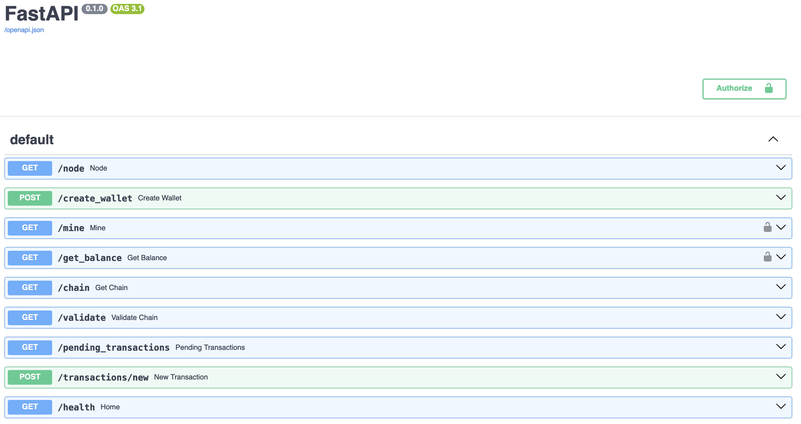

# PyChain
A simple yet practical implementation of a blockchain, PyChain is developed using Python and FastAPI. 
This project serves as an exemplary model for understanding the basics of blockchain technology.



## Getting Started
Follow these steps to get PyChain up and running on your local machine.

### Prerequisites
- Docker (for running Redis)
- Python 3.6 or higher

### Installation

#### Setting Up Redis DB
PyChain uses Redis as its database. Run Redis locally using Docker:

```bash
docker run -d -p 6379:6379 redis --requirepass admin
```

#### Installing Dependencies
Install the required Python packages:

```bash
pip install -r requirements.txt
```

## Running PyChain
Once the installation is complete, start the PyChain application:

```bash
uvicorn src.main:app --reload --port 8080
```

After running the above command, PyChain will be available at `http://localhost:8080`.

## Exploring PyChain
PyChain offers a simple interface to interact with a basic blockchain. You can add transactions, mine blocks, and inspect the chain through FastAPI endpoints. Visit `http://localhost:8080/docs` to explore the available API endpoints using FastAPI's Swagger UI.

